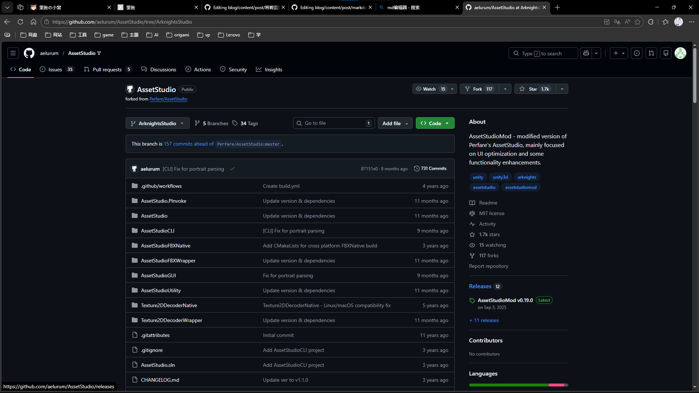
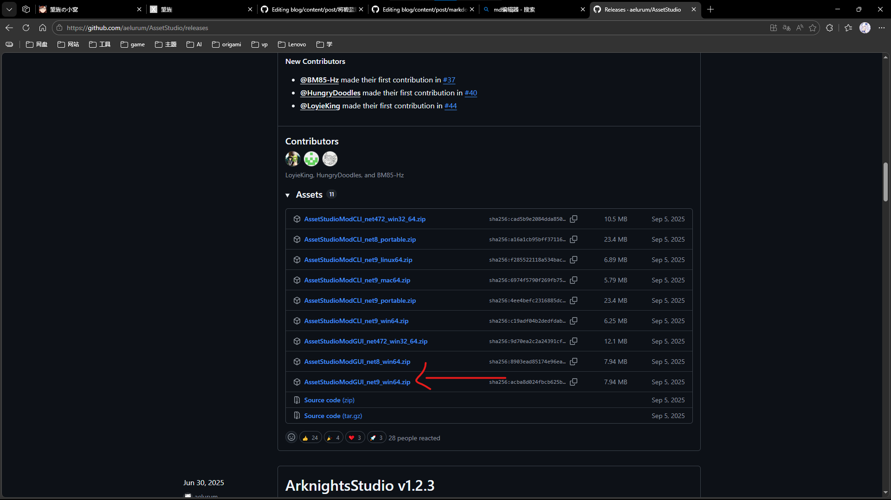
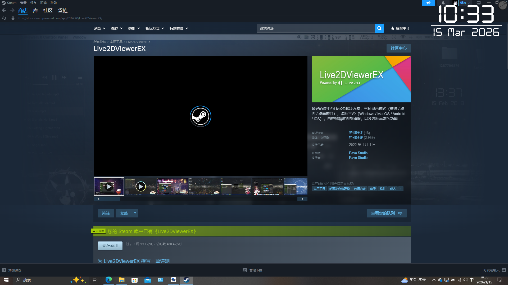
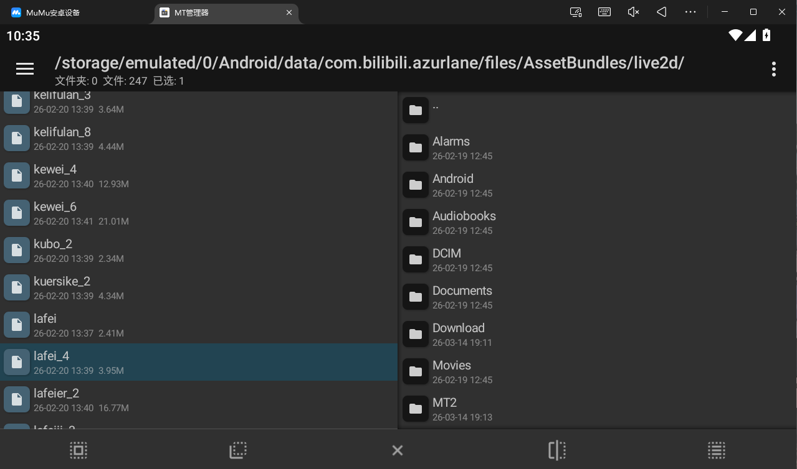
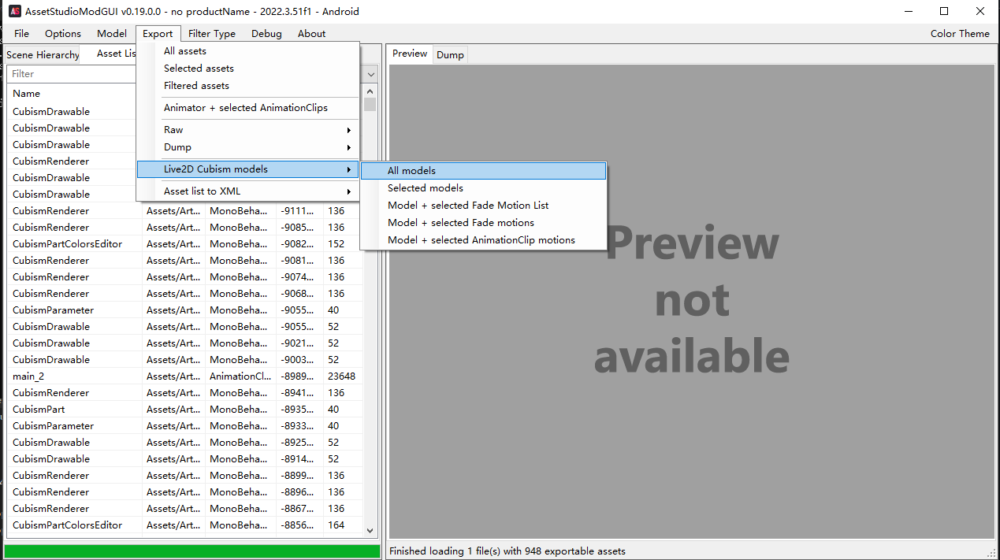
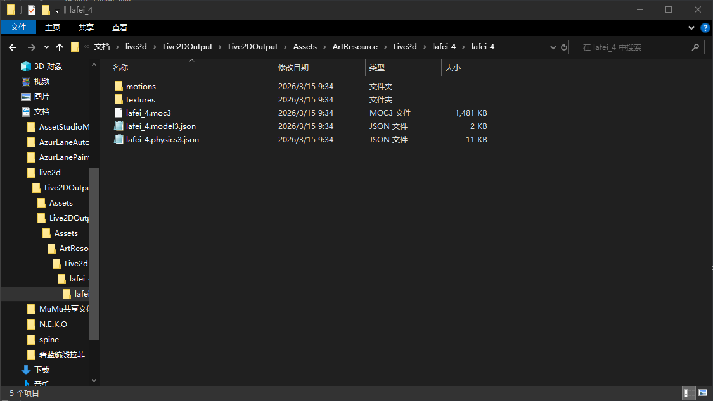

# 将碧蓝航线里喜欢的角色Live2d放到桌面上

## 工具

- **AssetstudioMod**

下载链接https://github.com/aelurum/AssetStudio/tree/ArknightsStudio

选择下载AssetStudioModGUI

- **Live2DViewerEX**

## 获取live2d文件

手机打开文件管理器前往/storage/emulated/0/Android/data/com.bilibili.azurlane/files/AssetBundles/live2d/目录下找到自己想要的文件，我要做的是拉菲的白兔迎春皮肤，就是lafei_4。

> "lafei"就是拉菲的拼音，后面的"_4"是拉菲的第4个皮肤,"_h"是婚皮"_g"是改造皮

## 使用AssetStudioMod进行解包

打开AssetStudioMod，选择Live2d的源文件，导出Live2d。就得到了我们需要的文件。

> 导入
> 
> 
> 导出Live2d文件
> 得到的所有文件

## 制作

打开Live2DViewerEX的EX工作室(或者打开Live2DViewerEX，点击上传物品-live2d编辑器)
选择模型文件夹，找到刚刚的live2d文件夹
首先创键配置文件

可以通过缩放调整大小

可以通过点击左侧motions文件预览动作

编辑配置文件

点击这里设定触摸区域

先点击hitareas，然后点击中间的加号，然后点击id后面的加号，然后就可以看见很多选项，这是l2d的各个部件。每个选项对应不同位置
这时选择几个touch的选项，一般在列表最后面

点击后会自动出现名字，下面的order代表图层层级，数字越大越靠上，用于在触摸区域重叠时做区分

此时继续点击加号，继续按上述步骤添加触摸区域。

至少添加完这三个

如果你想绑定更多的动作，你可以继续添加。

然后点击确定

勾选“显示可触摸区域”，可以看到出现红框，这些就是可触摸区域，对应刚刚选定的三个部件，头部，身体，胸部。

这时我们发现，胸部和身体的红框有一部分重叠了，如果点击胸部，会被身体的红框挡住，所以我们回到hitareas，将胸部的order设为1

这表示胸部比身体高一层，重叠时优先触摸胸部

然后我们开始绑定动作

首先还是点击编辑，选定motions选项，点击加号，选择start，确定。

Start代表开场动作

然后点击右边部分的加号，点击file后的加号添加动作文件

点击voice后面的加号添加语音文件

开场动画对应的动作文件肯定就是这个啦

看名字就可以猜出来对吧

然后可以在text部分输入台词，台词可在碧蓝航线wiki或萌娘百科查看

如此一来，一个动作就绑好了

然后继续绑下一个，继续点击中间部分的加号

这次选择idel，代表闲时动作，确定

后续操作和前边一样

动作选择和语音选择如图

这里其实可以添加多个动作，闲时会随机触发

然后继续回到左边，添加动作，这次选择taparea

可以看到，选择taparea后有个hitarea的选项，这就是你刚刚设定的触摸区域，随便选择一个就好

后续操作和前面相同，

然后用相同的方法添加另外几个触摸动作

动作和语音不一定非要对应，可以随便添加，同理，触摸区域也不用和动作对应。但是如果添加台词的话，台词和语音最好对应。

然后点击确认，回到初始页

这时你再点击触摸区域，发现已经有对应的动作了

这就说明绑定成功了。

然后左下角点击返回菜单

点击lpk生成器

这些地方的文本都是随便写，可自由命名，然后点击确定

然后点击右侧加号，找到你刚刚创建的配置文件，就在live2d文件夹下

打开，确认

如图所示

然后点击右上角导出为lpk

选择一个存放地点，保存，这里你还可以修改文件名字

这样一个lpk包就制作完毕了

接下来检查一下lpk可不可用

点击这两处来添加lpk文件
找到你刚刚做的lpk，打开

加载live2d

加载成功

以上！

#未完待续

